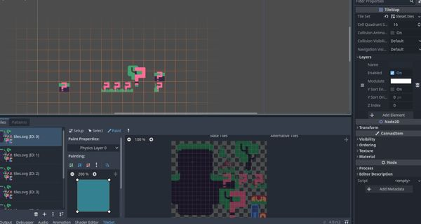
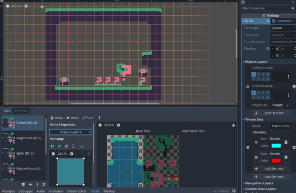

# unusable Godot 3 to Godot 4 TileSet/TileMap-converter

Warning, this thing is probably not for you. I just try to create a converter based on a sample from [https://github.com/GDQuest/godot-procedural-generation](https://github.com/GDQuest/godot-procedural-generation) in order to save some manual work. This thing works only rudimentary. I put this under the MIT license, so feel free to mix and match to your own desires.

KEEP BACKUPS OF YOUR DATA!

- Thomas

## what Godot 4 RC2 does to tilemaps

Godot 4 RC2 currently does not handle tilemap conversion very well [(RandomWalker Rooms.tscn from GDQuest's procedural generation course)](https://github.com/GDQuest/godot-procedural-generation)

My converter does it a bit better

## how to run the converter

run the script gd_converter.py either in the project folder that should be ported or use source and target dirs as parameters. If you want to try it, make sure to have a back. The target directory may overwrite files. Can't repeat this enough, this is not production code. No liabilities whatsoever.

## progress

- most of the parsing of a tileset is implemented, known as missing:
  - autotile bitmask reading
  - texture offset (now called texture origin)
  - additional physics info on collision shapes, also shape transform
  
- writing tilesets:
  - figured out most of the uuid stuff, leaving it out for external resources since it's likely not gonna be correct anyway and Godot falls back on the path then
  - tilesets are already quite usable
  - autotiling information is still not preserved, but terrains are being prepared
  - collision shapes are preserved, but most additional physics information is ignored, shape transform also

- tilemaps:
  - first off: actually those are scene files with tile maps
  - Godot does not convert tilemaps properly, only single tiles work, atlasses are removed from the tile data
  - scenes can contain a lot of stuff I don't want to touch, I will do my best to leave it clean and workable at worst a manual merge with a version converted by Godot and a version converted by this converter needs to happen.

- writing tilemaps (scenes with tilemaps):
  - it works, for my little use case.
  - in Godot 3 you could flip_h, flip_v and transpose a tile, now there are "alternative" tiles which can serve the same purpose, I did not care about any of it in the conversion. potentially I might later add translating flipping and so on to an alternative tile id, but then alternative tiles would have to be there in the first place
